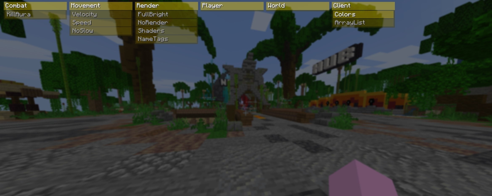

# Yoim

Yoim is an open-source Minecraft client built on Fabric for Minecraft Java Edition 1.21.11.

The project focuses on modular architecture, customizable visuals, and convenient client-side features.

## Screenshots

### ClickGUI

## Features

- Modular System — modules can be enabled, disabled, and configured individually.
- ClickGUI — graphical interface for managing modules and settings.
- Combat Modules — includes features such as KillAura.
- Movement Modules — includes features such as Speed and Strafe.
- Configuration System — save and load client settings.

## Requirements

- Minecraft Java Edition 1.21.11
- Java 21
- Fabric Loader

## Project Structure

- `module/` — client modules and their settings.
- `core/` — core client systems.
- `mixin/` — Minecraft modifications through Mixins.
- `resources/` — assets and mod metadata.

## Disclaimer

- This source code is still in development.

## License

See the "LICENSE" file for licensing information.

Licensed under the [MIT License](LICENSE).
